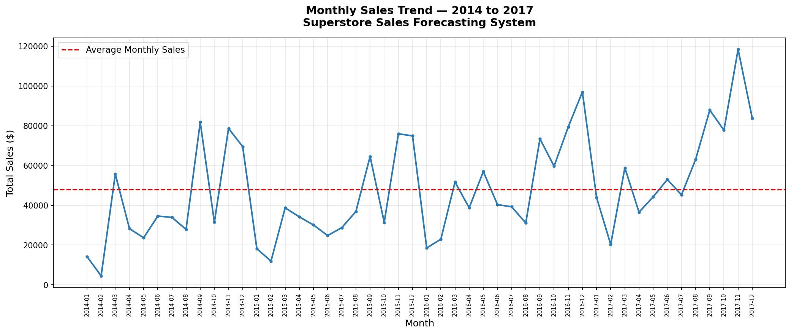
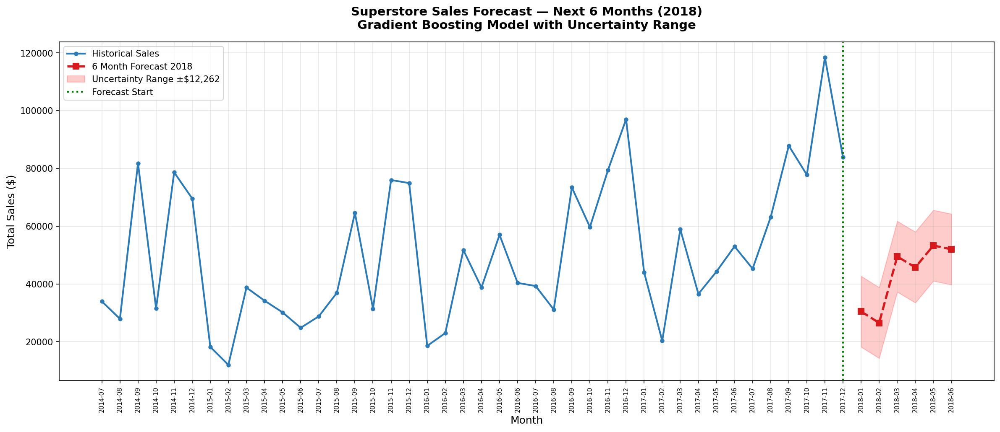
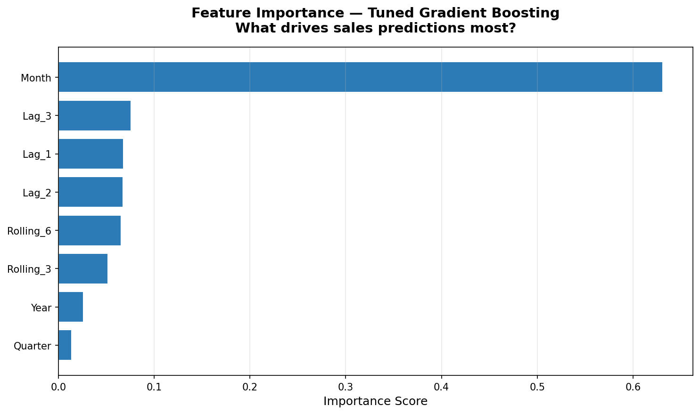

# FUTURE_ML_01 — Sales & Demand Forecasting System

**Author:** Project Maintainer   
**Program:** Future Interns Machine Learning Internship 2026  
**CIN ID:** 
**Task:** Task 1 of 3 — Sales & Demand Forecasting  

---

## Live Project
**GitHub:** https://github.com/wogenie/FUTURE_ML_01

---

## Project Overview

A production grade sales forecasting system built on the
Superstore Sales Dataset containing 9,994 transactions
from 2014 to 2017.

The system predicts monthly sales for the next 6 months
using engineered time series features and a tuned
Gradient Boosting model.

---

## Business Problem

Businesses need accurate sales forecasts to:
- Plan inventory and avoid stockouts
- Manage cash flow and staffing
- Identify seasonal demand patterns
- Make data driven business decisions

---

## Key Findings
```
Highest sales month: November 2017 — $118,447
Lowest sales month:  February 2014 — $4,519
Average monthly sales: $50,862
Total sales growth 2014-2017: 51.4%

Category Performance:
→ Technology: $836,154 — 17.40% margin
→ Furniture:  $741,999 — 2.49% margin ⚠️
→ Office Supplies: $719,047 — 17.04% margin

Regional Performance:
→ West:    $725,458 — highest
→ South:   $391,722 — growth opportunity
```

---

## Model Performance

| Metric | Value |
|--------|-------|
| Algorithm | Gradient Boosting Regressor |
| MAE | $12,262 |
| RMSE | $14,924 |
| R² | 0.6424 |
| Training months | 33 |
| Test months | 9 |

---

## 6 Month Forecast — 2018

| Month | Predicted Sales |
|-------|----------------|
| January 2018 | $30,452 |
| February 2018 | $26,506 |
| March 2018 | $49,487 |
| April 2018 | $45,747 |
| May 2018 | $53,287 |
| June 2018 | $51,980 |
| **Total** | **$257,459** |

---

## Key Visualisations

### Monthly Sales Trend


### Sales Forecast 2018


### Feature Importance


---

## Project Structure
```
FUTURE_ML_01/
├── data/
│   ├── raw/
│   │   └── Sample - Superstore.csv
│   └── processed/
│       └── monthly_sales_features.csv
├── notebooks/
│   ├── 01_eda.ipynb
│   ├── 02_feature_engineering.ipynb
│   └── 03_forecasting_model.ipynb
├── models/
│   └── sales_forecast_model.pkl
├── reports/
│   └── figures/
│       ├── 01_monthly_sales_trend.png
│       ├── 02_yearly_sales.png
│       ├── 03_category_sales.png
│       ├── 04_region_sales.png
│       ├── 05_seasonality.png
│       ├── 06_actual_vs_predicted_tuned.png
│       ├── 07_feature_importance.png
│       └── 08_sales_forecast_2018.png
├── requirements.txt
└── README.md
```

---

## Tech Stack

| Category | Tools |
|----------|-------|
| Language | Python 3.11 |
| ML | Scikit-learn |
| Data | Pandas, NumPy |
| Visualisation | Matplotlib, Seaborn |
| Deployment | Joblib |
| Version Control | Git, GitHub |

---

## Honest Limitations

- Dataset contains only 42 months of aggregated data
- No external factors included
- For production deployment minimum 3 years of
  daily data with marketing and economic indicators
  is recommended

---

## Author

Maintained under the `wogenie` GitHub account.  

